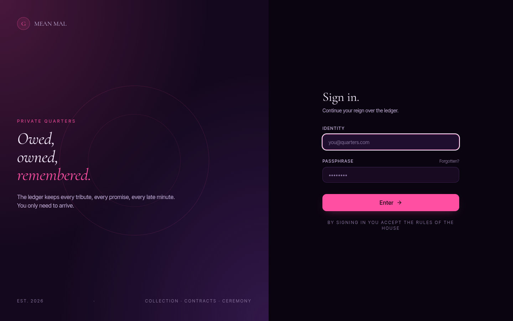
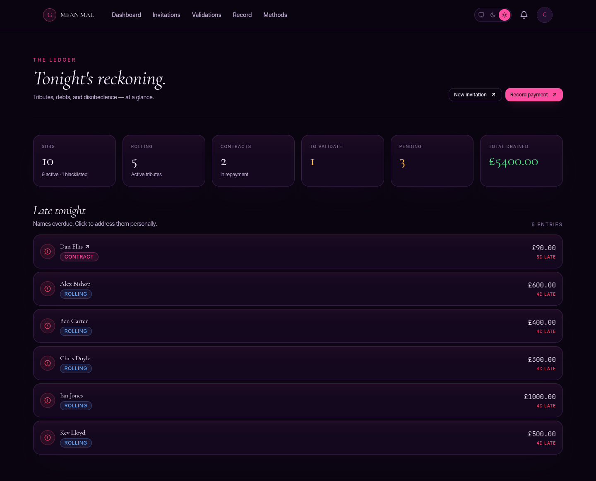

<h1 align="center">Debt Collector</h1>

<p align="center">
  Payment and debt tracker for findom-style relationships — invitations, tributes, rollings and debt contracts in one self-hosted app.
</p>

<p align="center">
  
  
  
  
  
</p>

<p align="center">
  
  
</p>


## What it is

Self-hosted web app with three roles — **admin**, **goddess**, **sub**.

- Goddess invites a sub with a fixed **entry tribute**; sub signs up via tokenised link.
- Sub **declares** payments sent off-platform (bank, crypto, gift cards, etc.); goddess **validates**, recategorises, or rejects.
- Categories: entry, tribute, rolling, weekly debt, debt payment, buyout.
- Payment methods are configurable per goddess.

Currency: GBP (£). Timezone: Europe/London. Single goddess per deployment.

## Stack

- **Server** — FastAPI, SQLModel, Alembic, Postgres, Argon2 + JWT, Resend
- **Client** — React 18, Vite, Tailwind 4, TanStack Query, react-router v7, openapi-fetch
- **Infra** — Docker hosts Postgres + Mailhog only; server and client run locally for hot-reload
- **Tooling** — `uv`, `pnpm`, `ruff`, `pyright` strict, `eslint`, `tsc`

---

## Local install

### Prerequisites

- **Docker** + Docker Compose (Postgres + Mailhog)
- **Python 3.12+** with [`uv`](https://docs.astral.sh/uv/) (`curl -LsSf https://astral.sh/uv/install.sh | sh`)
- **Node 20+** with [`pnpm`](https://pnpm.io/) (`npm i -g pnpm`)
- **GNU Make**

### One-time setup

```bash
git clone <this-repo> debt-collector
cd debt-collector

# 1. Copy env templates (do not commit the resulting .env files)
cp server/.env.example server/.env
cp client/.env.example client/.env

# 2. Install deps
make install         # uv sync (server) + pnpm install (client)

# 3. Start infra (Postgres on :5432, Mailhog on :1025/:8025)
make up

# 4. Migrate + seed fake data (11 subs covering every state)
make init-dbs
```

### Run

Two terminals (both hot-reload):

```bash
# terminal 1 — FastAPI on :8000
make server

# terminal 2 — Vite on :5173
make client
```

Open:

| URL                              | What                                    |
| -------------------------------- | --------------------------------------- |
| http://localhost:5173            | Web app                                 |
| http://localhost:8000/docs       | Swagger UI (full API contract)          |
| http://localhost:8025            | Mailhog inbox (catches all dev emails)  |

### Default credentials

Credentials are **not committed**. Copy `server/.env.example` → `server/.env` and pick your own local dev values for `ADMIN_EMAIL` / `ADMIN_PASSWORD` / `GODDESS_EMAIL` / `GODDESS_PASSWORD`. `make init-dbs` seeds whatever you put there.

For prod, generate strong unique passwords (`pwgen -s 32 1`) and rotate `JWT_SECRET_KEY` (`openssl rand -hex 32`).

`make init-dbs` also seeds 11 subs, each pre-set to a different state so every UI path has live data. All sub passwords: `ChangeMe!Dev123` (dev-only, defined in `seeds/fake_data.py`).

| Username | State                                                            |
| -------- | ---------------------------------------------------------------- |
| `alex`   | pending entry tribute (just signed up)                           |
| `ben`    | active, rolling tribute only                                     |
| `chris`  | active, rolling + active debt contract mid-way                   |
| `dan`    | active, debt contract with a pending adjustment                  |
| `eli`    | active, pending payment declaration awaiting validation          |
| `fred`   | active, late on rolling (triggers late-subs view + notification) |
| `gary`   | active, late on weekly debt instalment                           |
| `henry`  | active, contract near payoff (tests buyout flow)                 |
| `ian`    | active, proposed contract awaiting goddess review                |
| `jack`   | breached → blacklisted, awaiting reinstatement                   |
| `kev`    | blacklisted + forgiven (reinstated)                              |

---

## How to use

### Goddess flow (default after login as `meanmal@debt-collector.uk`)

1. **Dashboard** (`/goddess/dashboard`) — tonight's reckoning: subs total, rolling, contracts, pending validations, total drained, late payments.
2. **Invite a sub** — header → *New invitation*. Sets entry tribute amount + expiry. Copy the generated link or wait for the email in Mailhog.
3. **Validate declared payments** (`/goddess/validations`) — subs declare payments off-platform; you confirm/recategorise/reject.
4. **Record a payment** (`/goddess/payments/record`) — log a payment yourself when you already know it landed.
5. **Manage contracts** — create debt contracts per sub, propose adjustments, sign-off on amendments.
6. **Blacklist** — kick subs that breach.
7. **Payment methods** — configure accepted methods (bank, crypto, gift cards, …).

### Admin flow

1. Log in with the admin credentials above.
2. Open **Users** (`/admin/users`) — filter by role + status, search by display name/username.
3. Click **Impersonate** on any goddess or sub row. The app swaps to their view and shows a persistent banner *"Impersonating <name> — return to admin"*.
4. Use the feature as that user, then click **Return to admin** in the banner to swap back. Mutations during impersonation are audited against the admin's id.
5. **Run cron** (`/admin/cron`) — manually fires the daily 08:00 Europe/London job (late reminders, rolling recompute, debt instalments).

### Sub flow

1. **Sign up** via the tokenised invite link.
2. **Pay entry tribute** → unlocks the rest of the app.
3. **Declare payments** sent off-platform → wait for goddess validation.
4. **View contracts**, sign new ones, request adjustments.

### Theme

Topbar toggle (System / Dark / Light) — pink barbie dom on deep violet-black or soft rose paper. Persisted in localStorage.

---

## Layout

```
server/    FastAPI app — routers / controllers / daos / models
client/    React app — components / hooks / services / api
Docs/      spec (specs.md), use cases, diagrams (open Docs/diagrams.html in a browser), phased plan
Makefile   single entry point for every dev command
```

Stack-specific rules in `server/CLAUDE.md` and `client/CLAUDE.md`.

## Dev scripts

```bash
make help                  # list every target
make check                 # ruff + pyright + eslint + tsc + vite build (CI-equivalent)
make fmt                   # ruff format + prettier
make migration m="add x"   # autogenerate alembic revision from models
make migrate               # apply pending migrations
make flush-dbs             # drop + recreate schema (no seed)
make init-dbs              # flush + migrate + reseed fake data
make down                  # stop docker infra
```

After modifying SQLModel models always run `make migration m="…"`, inspect the generated revision in `server/alembic/versions/`, then `make migrate`.

After adding/editing any FastAPI route or Pydantic schema, regenerate the client types before touching the frontend: `cd client && pnpm sync-types` (server must be running on :8000). Commit the updated `src/types/api.generated.ts` alongside the backend change — the file is checked in so `tsc` can run without the server up.

## Environment variables

Full list with inline comments lives in `server/.env.example` and `client/.env.example`. Quick reference for the non-obvious ones:

| Var                          | Default                | Purpose                                                                 |
| ---------------------------- | ---------------------- | ----------------------------------------------------------------------- |
| `DATABASE_URL`               | local Postgres         | asyncpg connection string; must point at the Docker Postgres            |
| `JWT_SECRET_KEY`             | `change-me-…`          | signs access + refresh tokens; **must be rotated in production**        |
| `JWT_ACCESS_TTL_MINUTES`     | `15`                   | access-token lifetime                                                   |
| `JWT_REFRESH_TTL_DAYS`       | `30`                   | refresh-cookie lifetime                                                 |
| `PASSWORD_RESET_TTL_MINUTES` | `60`                   | password-reset JWT lifetime (matches spec §4.2)                         |
| `EMAIL_DRIVER`               | `smtp`                 | `smtp` (dev → Mailhog) or `resend` (prod → Resend API)                  |
| `RESEND_API_KEY`             | empty                  | required when `EMAIL_DRIVER=resend`                                     |
| `CRON_ENABLED`               | `true` (implicit)      | APScheduler fires daily at 08:00 Europe/London; disable for tests       |
| `APP_TIMEZONE`               | `Europe/London`        | business-rule timezone; all deadlines + cron times derive from it       |
| `R2_*`                       | empty                  | Cloudflare R2 bucket for signed contract PDFs (prod only)               |
| `ADMIN_*` / `GODDESS_*`      | see `.env.example`     | bootstrap credentials seeded on first `make init-dbs`                   |
| `VITE_API_BASE_URL`          | `http://localhost:8000`| client-side base for openapi-fetch                                      |

## License

MIT
